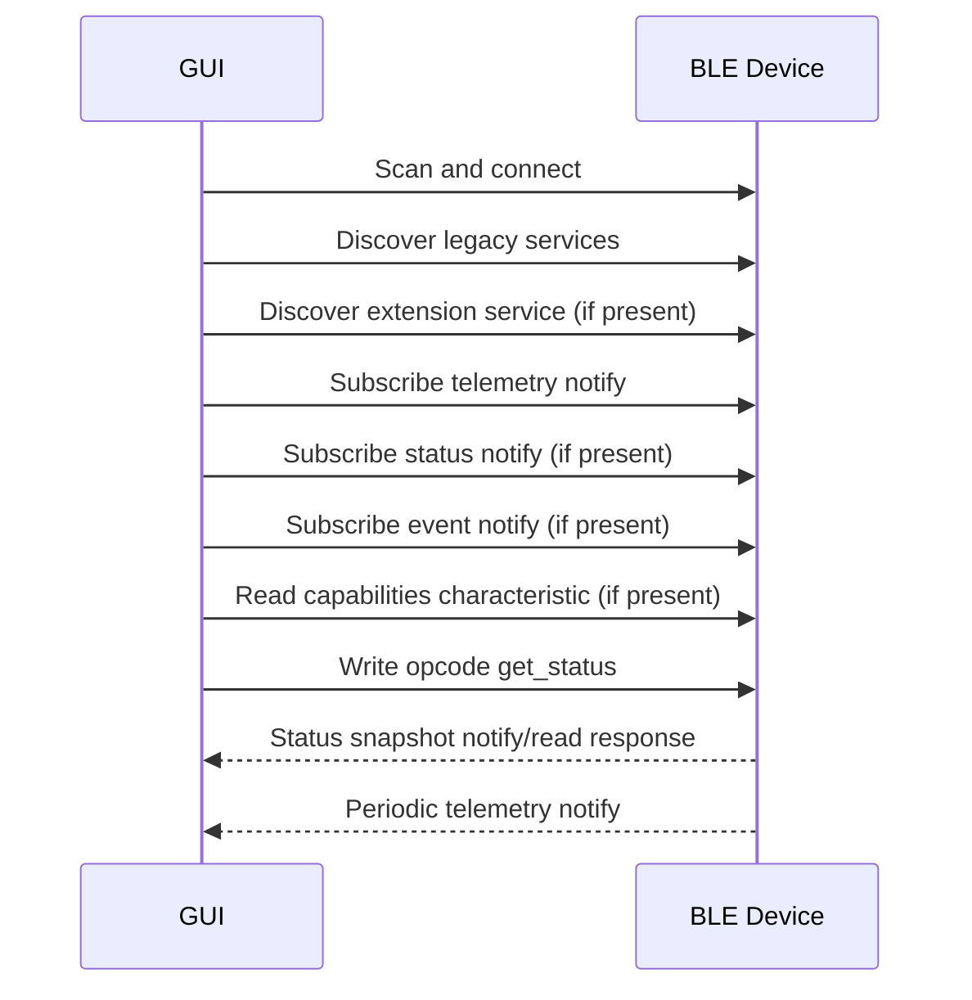

# BLE Transport v1 Draft

## 1. 目的

本書は、BLE transport における v1 仕様を実装可能な粒度まで具体化するためのドラフトである。

## 2. 基本方針

- 既存の BLE device name と legacy service / characteristic は可能な限り維持する
- 旧 GUI 互換に必要な最小構成は残しつつ、新 GUI 向け機能は extension service で追加する
- 周期 telemetry は固定長 binary notify を使う
- `get_status` と `get_capabilities` は extension service で扱う
- GUI は extension service がない場合でも legacy compatibility mode で接続できる

## 3. BLE Endpoints

### 3.1 Legacy-Compatible Endpoints

| Logical Name | UUID | Properties | Notes |
| :--- | :--- | :--- | :--- |
| `DEVICE_NAME` | `M5STAMP-MONITOR` | advertising name | Existing name |
| `CONTROL_SERVICE_UUID` | `0000180F-0000-1000-8000-00805F9B34FB` | service | Existing service |
| `PUMP_CONTROL_CHARACTERISTIC_UUID` | `00002A19-0000-1000-8000-00805F9B34FB` | `WRITE` | Existing pump control characteristic |
| `MONITORING_SERVICE_UUID` | `0000181A-0000-1000-8000-00805F9B34FB` | service | Existing service |
| `SENSOR_DATA_CHARACTERISTIC_UUID` | `00002A58-0000-1000-8000-00805F9B34FB` | `NOTIFY` | Existing telemetry characteristic |

### 3.2 v1 Extension Endpoints

v1 では、legacy endpoints を保ったまま custom extension service を追加する。

| Logical Name | UUID | Properties | Purpose |
| :--- | :--- | :--- | :--- |
| `EXTENSION_SERVICE_UUID` | `8B1F1000-5C4B-47C1-A742-9D6617B10000` | service | v1 extension root |
| `STATUS_SNAPSHOT_CHARACTERISTIC_UUID` | `8B1F1001-5C4B-47C1-A742-9D6617B10001` | `READ` `NOTIFY` | Latest status snapshot |
| `CAPABILITIES_CHARACTERISTIC_UUID` | `8B1F1001-5C4B-47C1-A742-9D6617B10002` | `READ` | Fixed-format capabilities payload |
| `EVENT_CHARACTERISTIC_UUID` | `8B1F1001-5C4B-47C1-A742-9D6617B10003` | `NOTIFY` | Warning / event payload |

方針:

- 旧 GUI は legacy endpoints のみを利用する
- 新 GUI は extension service があれば利用し、なければ fallback する

## 4. Endianness and Packing

- All binary values are little-endian
- `float32` uses IEEE 754 little-endian encoding
- All packet layouts in this document are packed byte layouts with no compiler padding

## 5. Message Flow

### 5.1 Connection Flow

### 5.2 Legacy Compatibility Flow

If `EXTENSION_SERVICE_UUID` is absent:

1. GUI connects using legacy service discovery only
2. GUI subscribes to telemetry notifications
3. GUI enables `Pump ON/OFF`
4. GUI marks `capabilities` and `status snapshot` as degraded / unavailable

## 6. Legacy Control Opcodes

| Opcode | Meaning | Payload Length |
| :--- | :--- | :--- |
| `0x55` | `set_pump_state(on)` | 1 byte |
| `0xAA` | `set_pump_state(off)` | 1 byte |
| `0x30` | `get_status` | 1 byte |
| `0x31` | `get_capabilities` | 1 byte |
| `0x32` | `ping` | 1 byte |

方針:

- v1 では command write payload を 1-byte opcode とする
- 将来 payload 付き command が必要になった場合は、新 opcode family を追加する

## 7. Telemetry Packet v1

### 7.1 Carrier

- Characteristic: `SENSOR_DATA_CHARACTERISTIC_UUID`
- Operation: `NOTIFY`
- Packet size: `32 bytes`

### 7.2 Byte Layout

| Offset | Size | Type | Field | Notes |
| :--- | :--- | :--- | :--- | :--- |
| `0` | `1` | `uint8` | `protocol_version_major` | v1 = `1` |
| `1` | `1` | `uint8` | `protocol_version_minor` | v1 = `0` |
| `2` | `1` | `uint8` | `telemetry_schema_version` | v1 = `1` |
| `3` | `1` | `uint8` | `header_flags` | default `0` |
| `4` | `4` | `uint32` | `sequence` | Monotonic telemetry sequence |
| `8` | `4` | `uint32` | `status_flags` | See `protocol_catalog_v1.md` |
| `12` | `4` | `float32` | `zirconia_output_voltage_v` | Canonical measurement |
| `16` | `4` | `float32` | `heater_rtd_resistance_ohm` | Canonical measurement |
| `20` | `4` | `float32` | `differential_pressure_selected_pa` | Canonical measurement |
| `24` | `2` | `uint16` | `nominal_sample_period_ms` | Target sample period |
| `26` | `2` | `uint16` | `telemetry_field_bits` | See `protocol_catalog_v1.md` |
| `28` | `4` | `uint32` | `diagnostic_bits` | Optional diagnostics; default `0` |

### 7.3 Interpretation

- GUI adds `host_received_at` when the packet is received
- GUI computes `flow_rate_lpm` from `differential_pressure_selected_pa`
- `telemetry_field_bits` allows future optional field negotiation while keeping packet size fixed

## 8. Status Snapshot Payload v1

### 8.1 Carrier

- Characteristic: `STATUS_SNAPSHOT_CHARACTERISTIC_UUID`
- Operation: `READ` or `NOTIFY`

### 8.2 Trigger

- GUI writes opcode `0x30` to `PUMP_CONTROL_CHARACTERISTIC_UUID`
- Device updates status snapshot characteristic
- Device may also emit unsolicited status notify when the pump state changes or a fault changes

### 8.3 Byte Layout

| Offset | Size | Type | Field | Notes |
| :--- | :--- | :--- | :--- | :--- |
| `0` | `1` | `uint8` | `protocol_version_major` | v1 = `1` |
| `1` | `1` | `uint8` | `protocol_version_minor` | v1 = `0` |
| `2` | `1` | `uint8` | `status_snapshot_schema_version` | v1 = `1` |
| `3` | `1` | `uint8` | `response_code` | `0=ok` |
| `4` | `4` | `uint32` | `sequence` | Latest telemetry sequence |
| `8` | `4` | `uint32` | `status_flags` | Current latched status flags |
| `12` | `2` | `uint16` | `nominal_sample_period_ms` | BLE nominal period |
| `14` | `2` | `uint16` | `telemetry_field_bits` | See `protocol_catalog_v1.md` |
| `16` | `4` | `float32` | `zirconia_output_voltage_v` | Latest cached measurement |
| `20` | `4` | `float32` | `heater_rtd_resistance_ohm` | Latest cached measurement |
| `24` | `4` | `float32` | `differential_pressure_selected_pa` | Latest cached measurement |

Packet size: `28 bytes`

## 9. Capabilities Payload v1

### 9.1 Carrier

- Characteristic: `CAPABILITIES_CHARACTERISTIC_UUID`
- Operation: `READ`

### 9.2 Trigger

- GUI reads the characteristic directly after service discovery
- GUI may optionally write opcode `0x31` before reading if explicit refresh is desired

### 9.3 Byte Layout

| Offset | Size | Type | Field | Notes |
| :--- | :--- | :--- | :--- | :--- |
| `0` | `1` | `uint8` | `protocol_version_major` | v1 = `1` |
| `1` | `1` | `uint8` | `protocol_version_minor` | v1 = `0` |
| `2` | `1` | `uint8` | `capability_schema_version` | v1 = `1` |
| `3` | `1` | `uint8` | `device_type_code` | See `protocol_catalog_v1.md` |
| `4` | `1` | `uint8` | `transport_type_code` | `1 = ble` |
| `5` | `1` | `uint8` | `fw_major` | Firmware semantic version |
| `6` | `1` | `uint8` | `fw_minor` | Firmware semantic version |
| `7` | `1` | `uint8` | `fw_patch` | Firmware semantic version |
| `8` | `2` | `uint16` | `supported_command_bits` | See `protocol_catalog_v1.md` |
| `10` | `2` | `uint16` | `telemetry_field_bits` | See `protocol_catalog_v1.md` |
| `12` | `2` | `uint16` | `nominal_sample_period_ms` | Nominal telemetry period |
| `14` | `2` | `uint16` | `status_flag_schema_version` | v1 = `1` |
| `16` | `2` | `uint16` | `max_payload_bytes` | For BLE sizing |
| `18` | `2` | `uint16` | `reserved` | default `0` |
| `20` | `4` | `uint32` | `feature_bits` | See section 9.4 |

Packet size: `24 bytes`

解釈:

- GUI は `device_type_code` / `transport_type_code` を logical string に復号する
- 復号規則は `protocol_catalog_v1.md` を参照する

### 9.4 Feature Bits

| Bit | Name | Meaning |
| :--- | :--- | :--- |
| `0` | `extension_service_present` | Extension service exists |
| `1` | `status_snapshot_notify_supported` | Status notify is supported |
| `2` | `event_notify_supported` | Event notify is supported |
| `3` | `legacy_control_opcode_supported` | `0x55` / `0xAA` supported |
| `4..31` | `reserved` | Reserved |

## 10. Event Payload v1

### 10.1 Carrier

- Characteristic: `EVENT_CHARACTERISTIC_UUID`
- Operation: `NOTIFY`

### 10.2 Byte Layout

| Offset | Size | Type | Field | Notes |
| :--- | :--- | :--- | :--- | :--- |
| `0` | `1` | `uint8` | `protocol_version_major` | v1 = `1` |
| `1` | `1` | `uint8` | `protocol_version_minor` | v1 = `0` |
| `2` | `1` | `uint8` | `event_code` | See section 10.3 |
| `3` | `1` | `uint8` | `severity` | `0=info,1=warn,2=error` |
| `4` | `4` | `uint32` | `sequence` | Latest telemetry sequence or `0` |
| `8` | `4` | `uint32` | `detail_u32` | Event-specific detail |

Packet size: `12 bytes`

### 10.3 Event Codes

| Code | Name | Meaning |
| :--- | :--- | :--- |
| `0x01` | `boot_complete` | Device startup completed |
| `0x02` | `warning_raised` | Warning state entered |
| `0x03` | `warning_cleared` | Warning state cleared |
| `0x04` | `command_error` | Invalid or failed command |
| `0x05` | `adc_fault_raised` | ADC fault became active |
| `0x06` | `adc_fault_cleared` | ADC fault cleared |

### 10.4 `detail_u32` Semantics

- `warning_raised`: active warning bit mask after the transition
- `warning_cleared`: warning bit mask that was cleared
- `command_error`: command id that triggered the error event
- `adc_fault_raised`: current `status_flags`
- `adc_fault_cleared`: `0`

## 11. GUI Behavior Requirements

- GUI shall subscribe to telemetry notifications before enabling record mode
- GUI shall read capabilities if extension service is present
- GUI shall treat missing extension service as degraded mode, not fatal error
- GUI shall compute `flow_rate_lpm` from `differential_pressure_selected_pa`
- GUI shall use `sequence` and host receive time to detect gaps and rate instability

## 12. Compatibility Notes

- Existing old firmware telemetry packet is also 32 bytes long
- Existing pump opcodes `0x55` and `0xAA` remain valid
- New GUI can support a compatibility parser for the old telemetry payload while the firmware migrates to the v1 layout

## 13. Open Questions

- Whether `diagnostic_bits` should remain reserved or hold warning counters in v1
- Whether `get_status` should always generate notify, or allow read-only polling

## 14. TODO

- [ ] Decide old-payload compatibility strategy inside the GUI adapter
