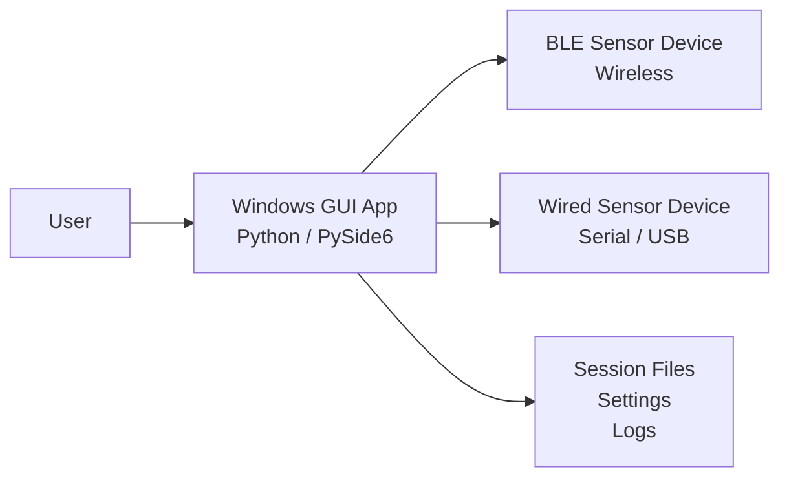
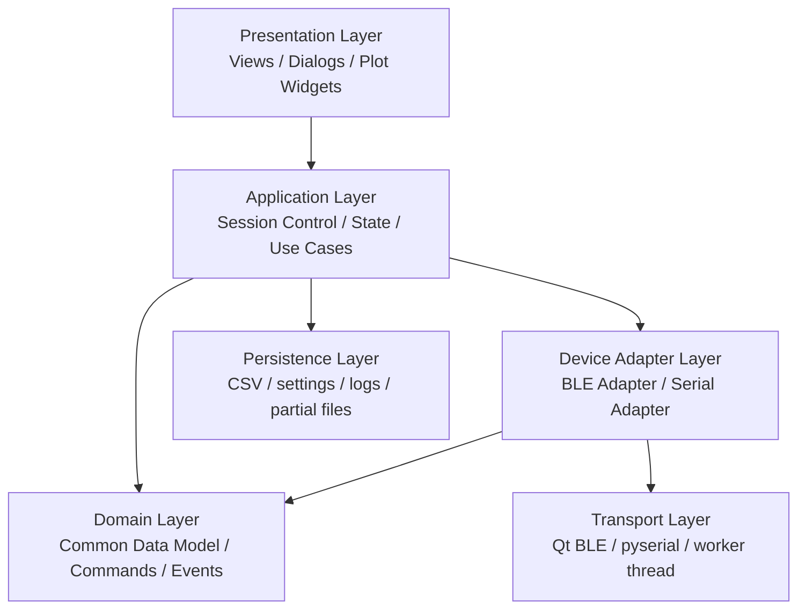

# System Architecture Draft

## 1. 目的

本書は、新システムの責務分割と全体構成を固めるための初期ドラフトである。

## 2. 設計方針

- 1 つの GUI アプリで 2 種類のデバイスを扱う
- ただし接続中のデバイスは常に 1 台のみ
- 起動時に動作モードを選択し、起動後も設定画面から変更できる
- GUI の上位レイヤは transport 差分を意識しない
- transport ごとの差分は adapter 層に閉じ込める
- 記録、可視化、状態表示は共通処理として再利用する
- 通信安定性を最優先とし、その次に UI / UX を重視する

補助文書:

- GUI 実装仕様: `gui_implementation_spec_v1.md`
- adapter 契約: `device_adapter_contract_v1.md`
- firmware 実装計画: `firmware_implementation_plan_v1.md`
- 実装バックログ: `implementation_backlog_v1.md`

## 3. システムコンテキスト



補足:

- BLE デバイスと wired デバイスは同時接続されない
- GUI は接続先ごとに adapter を切り替える
- 起動時にモード選択を行い、モードに応じて adapter を初期化する

## 4. 推奨アーキテクチャ



## 5. コンポーネント案

### 5.1 Presentation Layer

責務:

- 起動時モード選択画面
- 接続画面
- デバイス状態表示
- コントロールボタン
- グラフ表示
- ログ表示
- 設定ダイアログ
- モード切替ダイアログ

期待する特徴:

- `example_gui` のように、画面構成を比較的明確に分ける
- `old_gui` のような 1 ファイル集中構成は避ける
- device type によって必要な UI を出し分ける
- v1 の UI 文言は英語表記とする
- redundant な global status strip は置かず、状態表示は主要パネルに集約する
- settings 導線は left-side connection panel に統合する

### 5.2 Application Layer

責務:

- モード選択とモード切替
- 接続開始 / 切断
- 記録開始 / 停止
- セグメント管理
- capability 読み出し
- status 取得
- pump 制御
- 受信データの画面反映タイミング制御
- warning の発行と表示制御

候補クラス:

- `AppController`
- `SessionController`
- `RecordingController`
- `PlotController`
- `ModeController`
- `ConnectionController`
- `WarningController`

### 5.3 Domain Layer

責務:

- transport 非依存の共通データモデル
- 共通コマンドモデル
- 共通イベントモデル
- capability モデル
- サンプル、バッチ、状態、警告の表現
- canonical measurement と GUI-derived value の分離

共通データモデルの例:

- `ModeState`
- `DeviceInfo`
- `DeviceCapabilities`
- `StatusSnapshot`
- `TelemetrySample`
- `TelemetryBatch`
- `TelemetryMeasurements`
- `DerivedDisplayMetrics`
- `CommandRequest`
- `CommandResponse`
- `DeviceEvent`
- `SessionMetadata`

### 5.4 Device Adapter Layer

責務:

- transport ごとの差分吸収
- 接続管理
- 受信フレームを共通モデルへ変換
- GUI からのコマンドを device-specific な形式へ変換

候補 interface:

```text
DeviceAdapter
  open(params)
  close()
  is_connected()
  request_capabilities()
  request_status()
  set_pump_state(on)
  ping()
  connection_state_changed(signal)
  capabilities_received(signal)
  status_snapshot_received(signal)
  telemetry_received(signal)
  event_received(signal)
```

実装候補:

- `BleSensorAdapter`
- `SerialSensorAdapter`

### 5.5 Transport Layer

責務:

- 実際の I/O
- worker thread / async loop
- タイムアウト
- 再接続時のクリーンアップ
- 受信バッファ管理

実装候補:

- BLE: Qt Bluetooth もしくは Python BLE ライブラリの比較検討
- Serial: `pyserial` + worker thread

### 5.6 Persistence Layer

責務:

- セッション記録
- 設定ファイル保存
- partial file 検出
- ログ保存
- BLE / Wired 共通の CSV スキーマ管理
- `host_received_at` の記録管理

参考:

- `example_gui` の `recording_io.py` を強く参考にできる

## 6. 接続モード

### 6.1 BLE モード

特徴:

- 低から中頻度の計測
- 切断や再接続を考慮する必要がある
- GATT service / characteristic ベース
- 既存 BLE device name / UUID を可能な限り維持する

GUI で必要なこと:

- デバイス検索
- 接続状態表示
- 通知購読
- write command
- 通信異常の明示
- `Pump ON/OFF`
- `Get Status`

### 6.2 wired モード

特徴:

- 高頻度サンプリング
- 低遅延重視
- COM ポート / baudrate / parser robustness が重要
- BLE と同一の論理機能セットを持つ
- GUI 契約上は byte-stream serial over COM port とする
- v1 default は `115200 baud`, `8N1`

GUI で必要なこと:

- ポートスキャン
- 接続 / 切断
- 高頻度受信でも UI を詰まらせない構成
- 記録と描画のレート制御分離
- `Pump ON/OFF`
- `Get Status`

## 7. データフロー案

### 7.1 共通フロー

1. ユーザーが device type を選ぶ
   起動時はスプラッシュ / ランチャー画面、起動後は設定モーダルから選択する
2. GUI が対応 adapter を生成する
3. adapter が transport を介して接続する
4. adapter が受信フレームに `host_received_at` を付与し、共通 `TelemetrySample` に変換する
5. Application Layer が共通モデルを state に反映する
6. UI が state を見て描画を更新する
7. GUI が表示寄りの derived values を計算する
8. Recording Layer が同じ共通モデルを共通スキーマでファイルへ保存する

### 7.2 レート制御方針

- 受信レートと描画レートは分離する
- 記録は受信イベントに近い粒度で処理する
- 描画は GUI に優しい一定周期に間引く
- 高頻度デバイスほど、この分離の重要性が高い
- Wired モードでは、描画負荷よりも通信安定性を優先する

## 8. GUI 構成の叩き台

### 8.1 左カラム

- 接続設定
- デバイス状態
- 操作ボタン
- セッション記録
- settings 導線
- device-specific controls

### 8.2 右カラム

- メイングラフ
- 補助グラフ
- 時間軸切替
- スケール操作
- ログ / イベントビュー

### 8.3 UI 方針

- `example_gui` の「業務ツールらしい安定感」を参考にする
- 見た目は落ち着かせ、過剰にカジュアル・派手にしない
- manual scale 操作は明示的な UI を用意する
- デバイス共通部分と device-specific 部分を視覚的に分離する
- 起動直後にモードを選ぶ導線を持たせる
- 実行中も設定画面からモード変更に入れるようにする
- v1 の UI 文言は英語表記とする
- field 名と command 名は `protocol_catalog_v1.md` を参照する
- 画面上部に状態重複用の top bar は持たせない
- 長い状態文字列や file path が出ても、left / right カラム幅は安定させる

補足:

- 現在の GUI レイアウト案は local PySide6 prototype 上で確認済み
- local prototype / smoke test は macOS 上の Python 3.12 環境で進める

## 9. firmware 側アーキテクチャの検討項目

### 9.1 新 firmware で意識したいこと

- BLE 用と wired 用で共通の measurement core をできるだけ共有する
- センサ取得周期をより安定させる
- 計測タスクと通信タスクの責務を分ける
- GUI 側が欠落を観測できるように sequence 番号を持たせる
- transport 別の出力層だけを差し替えられる構成を目指す

### 9.2 old_firmware の改善ポイント

- メインループ一極集中から段階的に整理する
- 計測周期の基準時刻を `last = now` 型ではなく deadline ベースで扱うことを検討する
- 通信通知のタイミングと計測タイミングを分離する

## 10. 推奨する初期実装順

1. 共通データモデルを定義する
2. GUI 側の `DeviceAdapter` contract をコード化する
3. Serial adapter を先に作る
4. BLE adapter を実装する
5. 記録フォーマットを共通化する
6. firmware 側 protocol を新仕様へ合わせる

補足:

- 実際の着手順と作業粒度は `implementation_backlog_v1.md` を正とする
- firmware の詳細なモジュール分割は `firmware_implementation_plan_v1.md` を参照する

## 11. Open Questions

- BLE は Qt Bluetooth を使うか、別ライブラリを使うか
- BLE 既存 UUID を保ちつつ capability / status をどう拡張するか
- Plot widget の手動スケール UI を `example_gui` 相当でどう具体化するか
- raw payload の debug 保存をどう扱うか

## 12. TODO

- [ ] `StatusSnapshot` と `TelemetryMeasurements` を dataclass / code-level 型として定義する
- [ ] GUI state の責務分割を明文化する
- [x] 共通 measurement core を前提にした firmware モジュール分割案を作る
- [x] firmware 側タスク分割案を別紙化する
