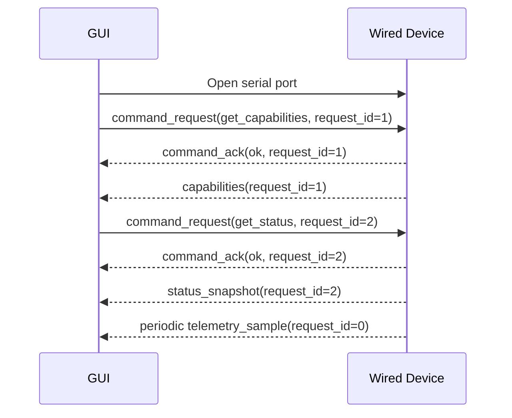
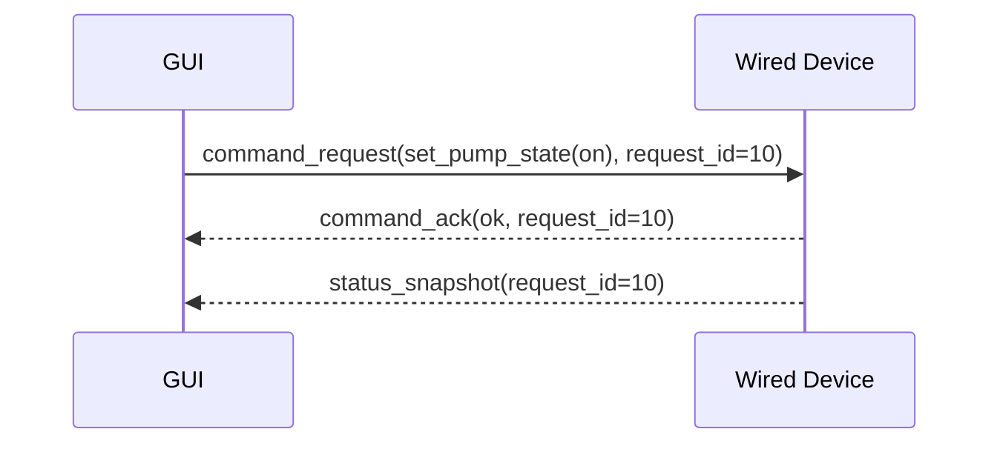

# Wired Transport v1 Draft

## 1. 目的

本書は、wired transport における v1 binary framing と message flow を実装可能な粒度まで具体化するためのドラフトである。

## 2. 基本方針

- `10 ms` 周期要件を満たすため、telemetry は binary frame を基本とする
- framing は軽量・再同期しやすい・CRC で破損検知できる構成にする
- command / response / telemetry を 1 つの binary frame 形式で統一する
- debug 用の text mode は必須要件にしない
- 本ドラフトは USB CDC / UART のような byte-stream 型 wired link を想定する

## 2.1 Serial Link Defaults

- Host-visible link type: `Windows COM port`
- Default baudrate: `115200`
- Line setting: `8N1`
- Flow control: none

## 3. Endianness and Integrity

- All numeric values are little-endian
- `float32` uses IEEE 754 little-endian encoding
- Frame checksum uses `CRC-16/CCITT-FALSE`
- CRC input range is bytes `2` through the final payload byte
  - Excludes the two SOF bytes
  - Excludes the final CRC field itself

## 4. Frame Format

### 4.1 Fixed Header

| Offset | Size | Type | Field | Notes |
| :--- | :--- | :--- | :--- | :--- |
| `0` | `1` | `uint8` | `sof_0` | fixed `0xA5` |
| `1` | `1` | `uint8` | `sof_1` | fixed `0x5A` |
| `2` | `1` | `uint8` | `protocol_version_major` | v1 = `1` |
| `3` | `1` | `uint8` | `protocol_version_minor` | v1 = `0` |
| `4` | `1` | `uint8` | `message_type` | See section 5 |
| `5` | `1` | `uint8` | `header_flags` | default `0` |
| `6` | `2` | `uint16` | `payload_length` | Payload bytes only |
| `8` | `4` | `uint32` | `sequence` | Telemetry or message sequence |
| `12` | `4` | `uint32` | `request_id` | `0` for unsolicited frames |

Header size: `16 bytes`

### 4.2 Trailer

| Offset from End | Size | Type | Field |
| :--- | :--- | :--- | :--- |
| `-2` | `2` | `uint16` | `crc16_ccitt_false` |

### 4.3 Total Frame Size

```text
total_frame_size = 16 + payload_length + 2
```

## 5. Message Types

| Type | Name | Direction | Notes |
| :--- | :--- | :--- | :--- |
| `0x01` | `telemetry_sample` | Device -> GUI | Periodic high-rate frame |
| `0x02` | `status_snapshot` | Device -> GUI | On-demand or unsolicited |
| `0x03` | `capabilities` | Device -> GUI | Response to capability request |
| `0x10` | `command_request` | GUI -> Device | Command envelope |
| `0x11` | `command_ack` | Device -> GUI | Immediate command result |
| `0x12` | `event` | Device -> GUI | Warning / lifecycle event |
| `0x13` | `error` | Device -> GUI | Parse or execution error |
| `0x14` | `ping` | GUI -> Device | Optional keepalive |
| `0x15` | `pong` | Device -> GUI | Optional keepalive response |
| `0x16` | `timing_diagnostic` | Device -> GUI | Wired-only device timing breakdown |

## 6. Telemetry Sample Payload v1

### 6.1 Payload Layout

| Offset | Size | Type | Field | Notes |
| :--- | :--- | :--- | :--- | :--- |
| `0` | `4` | `uint32` | `status_flags` | See `protocol_catalog_v1.md` |
| `4` | `2` | `uint16` | `nominal_sample_period_ms` | Expected sample period |
| `6` | `2` | `uint16` | `telemetry_field_bits` | See `protocol_catalog_v1.md` |
| `8` | `4` | `float32` | `zirconia_output_voltage_v` | Canonical measurement |
| `12` | `4` | `float32` | `heater_rtd_resistance_ohm` | Canonical measurement |
| `16` | `4` | `float32` | `differential_pressure_selected_pa` | Canonical measurement |

Payload size: `20 bytes`

### 6.2 Header Usage

- `sequence` in frame header is the telemetry sequence number
- `request_id` is `0`

## 7. Status Snapshot Payload v1

The payload layout is intentionally identical to `telemetry_sample`.

### 7.1 Trigger

- GUI sends `command_request(get_status)`
- Device replies with `command_ack`
- Device sends `status_snapshot` with the same `request_id`

### 7.2 Header Usage

- `sequence` in frame header is the latest telemetry sequence reflected by the snapshot
- `request_id` echoes the originating command request

## 8. Capabilities Payload v1

### 8.1 Payload Layout

| Offset | Size | Type | Field | Notes |
| :--- | :--- | :--- | :--- | :--- |
| `0` | `1` | `uint8` | `capability_schema_version` | v1 = `1` |
| `1` | `1` | `uint8` | `device_type_code` | See `protocol_catalog_v1.md` |
| `2` | `1` | `uint8` | `transport_type_code` | `2 = serial` |
| `3` | `1` | `uint8` | `fw_major` | Firmware version |
| `4` | `1` | `uint8` | `fw_minor` | Firmware version |
| `5` | `1` | `uint8` | `fw_patch` | Firmware version |
| `6` | `2` | `uint16` | `supported_command_bits` | See `protocol_catalog_v1.md` |
| `8` | `2` | `uint16` | `telemetry_field_bits` | See `protocol_catalog_v1.md` |
| `10` | `2` | `uint16` | `nominal_sample_period_ms` | Expected sample period |
| `12` | `2` | `uint16` | `status_flag_schema_version` | current schema = `2` |
| `14` | `2` | `uint16` | `max_payload_bytes` | Device receive capability |
| `16` | `4` | `uint32` | `feature_bits` | See section 8.2 |

Payload size: `20 bytes`

解釈:

- GUI は `device_type_code` / `transport_type_code` を logical string に復号する
- 復号規則は `protocol_catalog_v1.md` を参照する

### 8.2 Feature Bits

| Bit | Name | Meaning |
| :--- | :--- | :--- |
| `0` | `binary_transport_supported` | Binary framing is supported |
| `1` | `command_ack_supported` | Command ack frame is supported |
| `2` | `event_frame_supported` | Event frames are supported |
| `3` | `pong_supported` | Ping/pong is supported |
| `4..31` | `reserved` | Reserved |

## 9. Command Request Payload v1

### 9.1 Payload Layout

| Offset | Size | Type | Field | Notes |
| :--- | :--- | :--- | :--- | :--- |
| `0` | `1` | `uint8` | `command_id` | See section 9.2 |
| `1` | `1` | `uint8` | `arg_count` | `0` or `1` in v1 |
| `2` | `2` | `uint16` | `reserved` | default `0` |
| `4` | `4` | `uint32` | `arg0_u32` | Command-specific argument |
| `8` | `4` | `uint32` | `arg1_u32` | default `0` in v1 |
| `12` | `4` | `uint32` | `arg2_u32` | default `0` in v1 |

Payload size: `16 bytes`

### 9.2 Command IDs

| ID | Logical Command | Arg Usage |
| :--- | :--- | :--- |
| `0x01` | `get_capabilities` | No args |
| `0x02` | `get_status` | No args |
| `0x03` | `set_pump_state` | `arg0_u32 = 0 or 1` |
| `0x04` | `ping` | No args |
| `0x05` | `set_heater_power_state` | `arg0_u32 = 0 or 1`; ON can return `invalid_state` while pump is OFF |

## 10. Command Ack Payload v1

### 10.1 Payload Layout

| Offset | Size | Type | Field | Notes |
| :--- | :--- | :--- | :--- | :--- |
| `0` | `1` | `uint8` | `command_id` | Echoed command id |
| `1` | `1` | `uint8` | `result_code` | See section 10.2 |
| `2` | `2` | `uint16` | `reserved` | default `0` |
| `4` | `4` | `uint32` | `detail_u32` | Optional detail |

Payload size: `8 bytes`

### 10.2 Result Codes

| Code | Meaning |
| :--- | :--- |
| `0` | `ok` |
| `1` | `unsupported_command` |
| `2` | `invalid_argument` |
| `3` | `invalid_state` |
| `4` | `busy` |
| `5` | `internal_error` |

## 11. Event Payload v1

### 11.1 Payload Layout

| Offset | Size | Type | Field | Notes |
| :--- | :--- | :--- | :--- | :--- |
| `0` | `1` | `uint8` | `event_code` | See section 11.2 |
| `1` | `1` | `uint8` | `severity` | `0=info,1=warn,2=error` |
| `2` | `2` | `uint16` | `reserved` | default `0` |
| `4` | `4` | `uint32` | `detail_u32` | Event-specific detail |

Payload size: `8 bytes`

### 11.2 Event Codes

| Code | Name |
| :--- | :--- |
| `0x01` | `boot_complete` |
| `0x02` | `warning_raised` |
| `0x03` | `warning_cleared` |
| `0x04` | `command_error` |
| `0x05` | `adc_fault_raised` |
| `0x06` | `adc_fault_cleared` |

### 11.3 `detail_u32` Semantics

- `warning_raised`: active warning bit mask after the transition
- `warning_cleared`: warning bit mask that was cleared
- `command_error`: command id that triggered the error event
- `adc_fault_raised`: current `status_flags`
- `adc_fault_cleared`: `0`

## 12. Error Payload v1

### 12.1 Payload Layout

| Offset | Size | Type | Field | Notes |
| :--- | :--- | :--- | :--- | :--- |
| `0` | `1` | `uint8` | `error_code` | See section 12.2 |
| `1` | `1` | `uint8` | `source_message_type` | The frame type that caused the error |
| `2` | `2` | `uint16` | `reserved` | default `0` |
| `4` | `4` | `uint32` | `detail_u32` | Optional detail |

Payload size: `8 bytes`

### 12.2 Error Codes

| Code | Meaning |
| :--- | :--- |
| `0x01` | `crc_error` |
| `0x02` | `length_error` |
| `0x03` | `unknown_message_type` |
| `0x04` | `payload_parse_error` |
| `0x05` | `command_execution_error` |

## 13. Timing Diagnostic Payload v1

Timing diagnostic frames are wired-only engineering frames used to separate device sampling cadence from host receive jitter.
GUI and tools must accept the legacy `4-byte` payload, the extended `16-byte` payload, and the acquisition-breakdown `44-byte` payload.

### 13.1 Payload Layout

| Offset | Size | Type | Field | Notes |
| :--- | :--- | :--- | :--- | :--- |
| `0` | `4` | `uint32` | `sample_tick_us` | `micros()` at sample start |
| `4` | `4` | `uint32` | `acquisition_duration_us` | Measurement frontend acquisition time |
| `8` | `4` | `uint32` | `telemetry_publish_duration_us` | BLE + wired telemetry publish call time, excluding this timing frame |
| `12` | `4` | `uint32` | `scheduler_lateness_us` | Sample start lateness against the firmware deadline |
| `16` | `4` | `uint32` | `adc_total_duration_us` | ADS1115 frontend read duration |
| `20` | `4` | `uint32` | `differential_pressure_total_duration_us` | SDP differential-pressure frontend read duration |
| `24` | `4` | `uint32` | `ads_ch0_duration_us` | ADS1115 channel 0 read duration |
| `28` | `4` | `uint32` | `ads_ch1_duration_us` | ADS1115 channel 1 read duration |
| `32` | `4` | `uint32` | `ads_ch2_duration_us` | ADS1115 channel 2 read duration |
| `36` | `4` | `uint32` | `sdp_low_range_duration_us` | SDP810 low-range read duration |
| `40` | `4` | `uint32` | `sdp_high_range_duration_us` | SDP811 high-range read duration |

Payload size: `44 bytes`

Compatibility:

- Legacy payloads containing only `sample_tick_us` remain valid.
- The `16-byte` payload containing total acquisition / publish / scheduler timing remains valid.
- Timing diagnostic frames are not canonical measurements and do not change recording schema requirements.

## 14. Message Flow

### 14.1 Startup Flow



### 14.2 Pump Control Flow



## 15. Parser Requirements

- Parser shall resynchronize by searching for `0xA5 0x5A`
- Parser shall validate `payload_length` before allocating buffers
- Parser shall reject frames whose CRC check fails
- GUI shall treat `telemetry_sample` as the only high-rate frame type
- GUI shall compute `flow_rate_lpm` after parsing telemetry or status payloads

## 16. Throughput Notes

With a `20-byte` telemetry payload:

- frame overhead = `18 bytes`
- total telemetry frame size = `38 bytes`
- at `10 ms` period, data rate is approximately `3800 bytes/s`

This leaves substantial headroom at the v1 default baudrate `115200`.

With the current wired diagnostic payloads enabled:

- diagnostic telemetry payload frame: `54 bytes`
- extended timing diagnostic frame: `34 bytes`
- combined high-rate diagnostic stream at `10 ms`: approximately `8800 bytes/s`

This is still within the nominal `115200 baud` byte budget, but it leaves less margin.
Production transport work should therefore decouple measurement from writes and eventually make high-rate diagnostics capability-gated or buffered.

## 17. Open Questions

- Whether a text debug mode should coexist in the same firmware image
- Whether startup should include an unsolicited `capabilities` frame before any command request

## 18. TODO

- [ ] Decide if unsolicited startup `capabilities` frame is desirable
- [ ] Decide if `header_flags` should be used for fragmentation in future versions
